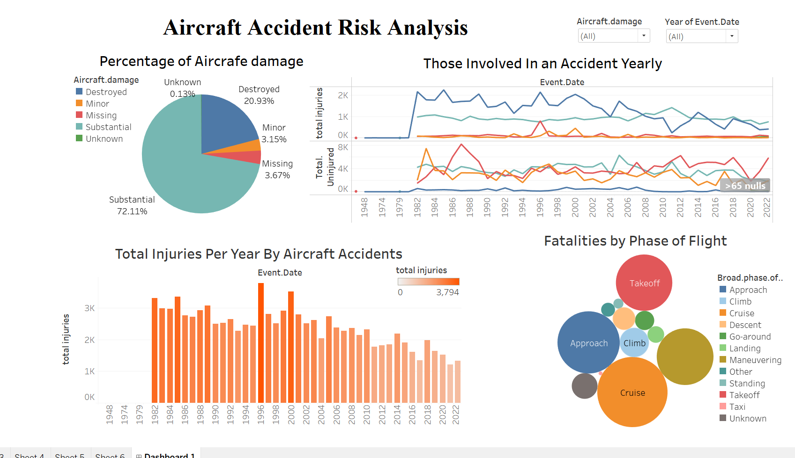

# Potential Risks Of Airflight
## Key stakeholders Ultimate High Company
##  Business Understanding
 
 ### Objective
The goal of this project is to predict which aircraft are the lowest risk for the company since the company wants to expand into new industries to diversify its portfolio. They are interested in purchasing operational and private airplanes for commercial and private enterprises but have no idea of the risk of aircraft.

### Key Questions
1.Which manufacturers (based on 'Make') have the most accidents?
2.What type of engine on the aircraft determined the most and least fatal injuries while in the risk?

### Success criteria
1. Actionable Insights -The prediction should lead to actionable insights that the company can use when purchasing an aircraft

2. Accuracy- The model has high accuracy in prediction 
 
### Constraints
1. Data Quality -The accuracy depends on the completeness of the data

## The Data Understanding

The `data` folder I am working with is from [**Kaggle**](https://www.kaggle.com/datasets/khsamaha/aviation-accident-database-synopses). The dataset has been used data set has been used by other data scientists before and is accessible for anyone to look through it, it is updated often. The data  is in **csv** format inside a folder named data. I then read through the data using the panda's library in order to get a data frame as our output . While understanding the output we realize the data frame has 90348 rows and 31 columns . The columns define our data by giving the different fields their names while the rows hold the information of different columns about potential risks of air flight.

## The Data analysis

Upon examining the correlation between aircraft make and fatal injuries, I found that certain manufacturers are associated with a higher incidence of fatal accidents, indicating increased risk. Similarly, when analyzing the correlation between aircraft models and fatal accidents, the results were consistent: some models exhibited lower risks and resulted in fewer fatal injuries, while others demonstrated higher risks and were linked to more severe outcomes.

Furthermore, I investigated the relationship between engine types and fatal injuries. The findings revealed that specific engine types are associated with a greater number of fatal incidents, whereas others have shown a more favorable safety record.

Finally, I explored the correlation between aircraft damage and total injuries. The results suggest that increased aircraft damage correlates with a higher likelihood of fatal injuries, underscoring the critical importance of maintaining aircraft integrity for passenger safety.

# Recommendation

1.Brand Selection: The make of the aircraft plays a crucial role in risk management. Our analysis indicates significant disparities in fatal injury rates among different manufacturers. Opting for reputable brands with proven safety records can substantially mitigate risks associated with air travel.

2.Model Considerations: The specific model of the aircraft is a vital factor in ensuring passenger safety. Some models consistently demonstrate lower risk profiles and fewer injuries, while others exhibit higher vulnerabilities. Choosing models with strong safety performance can significantly enhance flight safety.

3.Engine Type Evaluation: The type of engine installed on an aircraft can greatly influence its safety record. Certain engine types have been linked to higher fatality rates, while others contribute to safer flight experiences. Prioritizing aircraft with reliable and safer engine configurations is essential for reducing potential risks.

